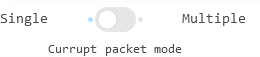
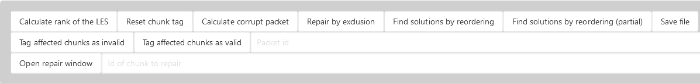
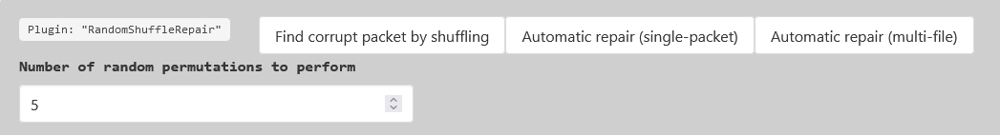

# Semi-automatic reconstruction for NOREC encoded files.

This tool is intended for use with files encoded using the NOREC4DNA encoding system for DNA data storage.
However, the concept behind this tool could be used for any fountain-code based storage system.

# Install:

```
git clone git@github.com:thejanky/DR4DNA.git --recurse-submodules
cd DR4DNA
pip install -r requirements.txt
```

# Run:

```
python app.py <norec4dna-based-ini-file>
```

After a short time, the log should output: `Dash is running on http://127.0.0.1:8050/`. From this point, the app can be
controlled using a browser.

# Usage:

DR4DNA Control Overview:

The first line displays the most current information from DR4DNA.
Following right below is the MAGIC information about the decoded data. This gives an indication to which filetype was
encoded and if the file header is correct.

The third row contains the list of possible invalid packets as calculated from the tagged rows.

Switch to select single or multiple error detection mode.
By default, DR4DNA assumes only a single corrupt packet is corrupt. Switching to multiple error mode typically
requires more known data



Plain HEX and ASCII view of the decoded data:

Clicking on a row cycles its status. (Corrupt, Correct, Unknown)
The status of a row will be indicated by colors:

- Red: Corrupt
- Green: Correct
- Grey: Unknown
- White: Correct by current assumptions
- Light red: possibly corrupt by current assumptions
- Yellow: Missing / not yet decoded


Clicking on a row will NOT automatically update the calculation. To update the calculation, click on the "_Calculate
corrupt packet_" button.
To reset the tagged chunks, click on the "_Reset chunk tag_" button.



#### Rank calculation:

If the rank of A is smaller than the rank of the augmented matrix [A|b], then system contains a linear dependent and thus recoverable error.
If the rank of [A|b] is smaller than the number of chunks, then the equation system can not be fully solved. A partial
recovery might be possible or a user has to manually solve a missing row. (automatically tagged as yellow)

The result will be shown in info bar at the top.

#### Repair by exclusion:
This wil attempt to solve the linear equation system by excluding the calculated packet(s).

While useful in some special cases, the use of the automatic "_RandomShuffleRepair_" should be preferred.

#### Find solutions by reordering:
This will create all possible permutations of the equation system and save them to "./reordered_solution/".

If the header-chunk of the NOREC4DNA encoding exists and contains a file-wide checksum, this will automatically return the version which produces the correct checksum.

#### Find solutions by reordering (partial):
In this mode, only the packets that are possibly corrupt will be used for the calculation.

If the header-chunk of the NOREC4DNA encoding exists and contains a file-wide checksum, this will automatically return the version which produces the correct checksum.

#### Save file:
This will save the reconstructed data to a file. The file will be saved to the same directory as the input file.

#### Tag affected chunks as (in)valid:
By entering a packet id (using the input-order) and clicking on the appropriate button, the user can manually tag all chunks that were derived using the selected packet as valid or invalid.
This allows the used to define packets as correct or corrupt.

#### Manual correction:

Once a single packet has been detected, a manual repair can be started by entering any affected chunk number the user
wishes to repair and pressing "_Open repair window_".


## Plugins:

#### Plugin loading:
DR4DNA uses a plugin system to allow the user to define custom repair methods. 
Correct plugins inside the `repair_algorithms` folder will be automatically loaded at launch. A plugin will be loaded if its is_compatible method returns `True`.
Typically, this is done by checking the results of the magic check or by checking the file extension. (If a header chunk is present)

A user can also manually load a plugin by clicking on the corresponding button located above the plugin section:


#### LanguageToolTextRepair:
For raw text encoded into DNA using fountain codes, this plugin can be used to detect and repair errors.
This plugin first detects the language of the encoded text and then uses the LanguageTool API to detect all possible errors and attempts to correct them.
Instead of directly using the correction returned from the API, the plugin uses the alignment of the decoded chunks to find the column(s) with the highest number of errors.
These errors are additionally grouped by their difference to the decoed data.


Using these information, the plugin calculates the corrupt packet per column (for the first _n_ rows):
Any row which has an error equal to the most common error in the column is assumed to be incorrect. Additionally, any row without any error is assumed to be correct.


- The pluign allows to change the number of rows to analyze. This can dramatically reduce the calculation time, but might also lead to a lower accuracy.
- "_Tag incorrect rows_" will tag all rows that are assumed to be incorrect. This will reduce the set of possibly corrupt packets.
- "_Tag correct rows_" will tag all rows that are assumed to be correct.
- "_Tag (in)correct columns_"  will tag all columns that with an error, counting the number of errors in the column.
- "_Repair_" performs an automatic repair approach as described above.
- 
#### RawTextRepair:
This is a deprecated plugin for analysing the character distribution of plain texts to detect possible errors.
We recommend using the LanguageToolTextRepair plugin instead.

#### BmpFileRepair:
This plugin can be used to repair bmp files encoded using fountain codes. 

- "_Reload Image_" will reload the image from the current data. The image will be displayed in canvas view.
- The canvas if the BMP plugin is active, a canvas will be activated to show the image. 
The canvas can be zoomed in and out  and areas can be selected using the buttons below. 
The center pixel of any marked area will be marked as an error. 
Allowing for an interactive tagging of corrupt chunks / the exact position in the chunk.
While we recommend using external tools to correct single errors and upload the repaired version, using the canvas together with the "_Find incorrect positions_" can be a fast way to find the corrupt packet.
- "_Download Data_" will download the current data as a bmp file. The header data might be changed as the kaitaistruct parser tried to repair certain datapoints to correctly parse the file.
- "_Show KaitaiStruct" displays a structured view of the bmp file header including the start + end positions for each field.
- "_Width / Height of the image_" can be used to manually fix the width and height of the image. This can be useful if an error corrupted the appropriate fields in the header. DR4DNA will make sure that the aspect ratio results in all pixels being used (and the length of the file will be correct!)
- "Drag and Drop or Select Files": A partially (manually) repaired file (e.g. using "_Download Data_" and Photoshop) can be uploaded. This plugin will then calculate the corrupt packet and error delta and will thus automatically repair the full image.
- "_Find incorrect positions_": This will calculate the (possibly) corrupt packet(s) based on the marked areas in the canvas. Any affected chunk will be tagged accordingly.
- "_Tag (in)correct columns_": This will tag the incorrect columns, counting any errors in the columns. This will give an indication to where inside the packet an error occurred.
- "_Automatic Repair_" will attempt to repair the image using the partially recovered version. The result will be shown in the canvas.


#### ZipFileRepair:
Similar to the BMP plugin, this plugin uses KaitaiStruct to parse and analyse zip files encoded using fountain codes.
- "_Show KaitaiStruct" displays a structured view of the zip file header including the start + end positions for each field.
- "_Tag (in)correct rows_" will tag all rows that are assumed to be incorrect. For this, the ZIP file-headers will be compared against their corresponding central directory entries. as well as against the end of central directory entry.  This will reduce the set of possibly corrupt packets.
- "_Tag (in)correct columns_"  will tag all columns that with an error, counting the number of errors in the column.
- "_Create corrected version(s)_": Attempts to create a corrected version based on the known invalid and valid rows. 
This will first calculate the corrupt packet(s) and then attempt to repair the file using any redundant information present in the zip structures.
If there is more than one possible corrupt packet left (not enough rows could be identified as correct or corrupt), the multiple differing version of the encoded file will be created.


#### RandomShuffleRepair:
This is the most important plugin, as it allows a fully automatic repair if the rank of the matrix `A` is smaller than the rank of the augmented matrix `[A|b]`.
The plugin is only active in this case.
- "_Number of random permutations to perform_": This is the number of random permutations that will be performed to find a differing solution. Typically, 1-2 is sufficient, however increasing this value might help if no solution can be found.
- "_Find corrupt packet by shuffling": Perform random permutations of the matrix `A` and checks if the result of the gaussian elimination produces a differing result,
if so, one version of each differing row must be produced using the corrupt packet while the other version was not, equally, all packets that have not differing bytes must either both have or have not used the corrupt packet to reduce the row.
Using enough of these information, the corrupt packet can be identified.
- "_Attempt automatic repair_": This will use the technique described above to attempt an automatic repair. The error delta can be directly calculated from one of the differing set of the same row.



#### UploadRepair:
Just as described for the BMP based plugins, this plugin can be used to upload a repaired version of the file.
This more general approach allows the use of external forensics tools to partially repair a corrupt file, 
upload it to DR4DNA and let the tool calculate the corrupt packet and error delta to automatically repair any still existing errors.

Any changed byte will be marked as an error and tag the corresponding chunk as corrupt. If enough of the file is changed, the corrupt packet can be identified.
If the changed bytes in the file do not all have the same delta (for an error in the same column), the most common error delta will be used.
- "_Download Data_": Downloads the current data as a file. If a header-chunk exists, the file will have the correct length and the filename as specified in the header.
- "_Drag and Drop or Select Files_": As described above, a partially repaired file can be uploaded.
- "_Find incorrect positions_": This will calculate the (possibly) corrupt packet(s) based on the changed data in the uploaded file. Any affected chunk will be tagged accordingly.
- "_Tag (in)correct columns_": This will tag the incorrect columns, counting any errors in the columns. This will give an indication to where inside the packet an error occurred.
- "_Automatic Repair_" will attempt to repair the file using the partially recovered version. The result will be shown in the hex view.
- "_Automatic Repair (multi-file)_" if there are (based on the changed file) multiple packets which might be the corrupt packet, this will create a repaired version of the file for each of the possible corrupt packets.
If the header-chunk of the NOREC4DNA encoding exists and contains a file-wide checksum, this will automatically return the version which produces the correct checksum.


#### MissingRowRepair:
This plugin is only active if the rank of the matrix `A` is smaller than the number of chunks and a decoding would thus not be possible.
In this case, any not decoded chunk will be treated as an all 00-byte chunk. These rows will be highlighted in yellow.

- "_Analyze_": This will calculate the missing rows and highlight them in yellow.
- "_Row to manually update_" sets the chunk number which a user can then manually update/add.
If a yellow row is selected, this will increase the rank of the matrix and thus allow more chunks to be resolved.
- "_Row content to manually update. (as HEX)_": Filling this row with the correct (or close to correct) bytes will insert it to the equation system to allow more chunks to be resolved.
- "_Automatic Repair_": Will apply the changes to repair the equation system by adding the rows to it.
- "_Commit added rows to the initial GEPP_" also adds the repaired rows to the initial equation system such that other plugins can interact with the newly added rows to repair any errors still present in the file.


# Cite:

If you use this tool for scientific research, please cite the following paper:

``` 
TBD 
```