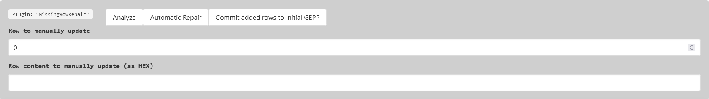

# Data recovery methods for DNA storage based on fountain codes.

DR4DNA is a tool to recover corrupted data encoded using fountain codes. With its main focus on the recovery of data
encoded into DNA.
The idea of this approach is to use the redundancy of fountain codes to recover data from a set of corrupted chunks.
For this both the information of the encoded data and the information of the encoding process is used.
If not enough information for an automatic recovery is available, the user can manually tag chunks as corrupt or correct
or use plugins to identify and manually correct errors which can then be used to recover the rest of the data.

This tool is intended for use with files encoded using the [NOREC4DNA](https://github.com/umr-ds/NOREC4DNA.git) encoding
system for DNA data storage.
However, the concept behind this tool could be used for any fountain-code based storage system.

# Requirements

Fot the installation, Python 3.8 (or newer) and pip (we recommend 22.1.2 or newer) is required
The software has been tested on Ubuntu 20.04, Ubuntu 22.04 and Windows 11, but should work on any system supporting
Python 3.

# Installation

```
git clone git@github.com:umr-ds/DR4DNA.git --recurse-submodules
cd DR4DNA

# optional: create a virtual environment
python -m venv venv
source venv/bin/activate

# then run:
python setup.py install

# alternatively, the depndencies can and might need to be installed using pip:
pip install -r requirements.txt
```

:warning: A internet connection is required for the installation as the setup script will download the required
dependencies. Without an internet connection or cached versions of the required dependencies, the installation will fail
with an error code 1!

This will install all required dependencies including the NOREC4DNA framework in the virtual environment.
The installation should take less than 5 minutes on a typical desktop pc, but can take longer if an older pip version is
used or if dependency conflicts exists (e.g. if no virtual environment is used).

# Using Docker:

DR4DNA can be used using Docker. This will automatically install all required dependencies and start the tool.

## Using the docker image from DockerHub:

```bash
docker pull mosla/dr4dna
docker run -v ./working_dir:/DR4DNA/working_dir -p 8050:8050 mosla/dr4dna
```

## Building from source:

```bash
docker build --tag dr4dna .
docker run -v ./working_dir:/DR4DNA/working_dir -p 8050:8050 dr4dna
```

### :warning: Note:

When using the docker image, DR4DNA expects the input ini file in the following location: "
working_dir/input.ini" with the corresponding fasta file in the same folder!

#### Example:

- Place your <name>.fasta file into an empty folder <working_dir>
- Place your <name>.ini file into the same folder <working_dir> and rename it to **input.ini**
- Run the docker image using the following command:

```bash
docker run -v ./<working_dir>:/DR4DNA/working_dir -p 8050:8050 mosla/dr4dna
```

where <working_dir> is the name of the folder containing the input files!

# Concept:

As already mentioned, this tool aims to provide a way to recover data encoded using fountain codes.
Compared to conventional error correction, our approach aims to recover data without additional overhead through the
dependencies between the encoded chunks or - if an automatic recovery is not possible - by using information about the
encoded data. This information can be used to manually tag chunks as corrupt or correct or to use plugins to identify
corrupt data and correct it.
Additionally, it is possible to interface with external file recovery tools which can be used to partially repair a file
and then load this file into DR4DNA to automatically repair the rest of the file.


This tool is uses a plugin system to allow the user to define custom repair methods while integrating the bare logic in
a backend. Our backend uses the Plotly / DASH Framework to serve the content as a lightweight Web-App. While this
event-driven design allows for a flexible and extendable architecture, it may reduce readability of the code.

## Automatic recovery:

The generated and stored packets of a fountain code can be represented as a linear equation system, where solving it (
e.g. using Gaussian elimination or belief propagation) yields the orignial message.
By calculating A^-1 while solving, it is possible to calculate which packets were used for each chunk during the
decoding.

If the linear equation system is inconsistent (multiple differing results can be derived from the same equation system),
the corrupt packet can be identified by permutating the equation system and comparing the used packets for chunk whith
equal and differing content. Using the difference (error delta) of the differing chunks, the corrupt packet can
additionally be corrected.

## Manual or content based recovery:

If the equation system is consistent, the corrupt packet has to be found either using:

- manual tagging of chunks as corrupt or correct until only one possible corrupt packet is left (using A^-1)
- using plugins to identify corrupt chunks and, if possible, correct them.
- using external tools in combination with the UploadRepair plugin to first partially repair a file and then use DR4DNA
  to automatically repair any remaining errors.

# Usage

```
python app.py <norec4dna-based-ini-file>
```

After a short time, the log should output: `Dash is running on http://127.0.0.1:8050/`. From this point, the app can be
controlled using a browser.

## Example data:

The `eval` folder contains examples and all experiment data used for the evaluation of the tool.

To run the tool on the example data, run:

```bash
# in-vivo experiment with missing data
python app.py eval/Dorn5_Thu_Feb_24_10_14_38_2022.ini
```

By clicking on "Calculate rank of the LED" in the Web-UI, we can then see:

```
rank(A)=175, rank(A|b)=175: augmented rank (175) < number of chunks (176), but partial recovery might be possible...
```

Using the `Analyze`-Button of the "MissingRowRepair" plugin, we can then detect all missing rows (yellow).
To manually add content for a missing row we can then choose the row (e.g. 0) and insert the HEX content of this row
into `Row content to manually update (as HEX)`
(e.g. `00 00 00 00 00 00 00 00 00 00 00 00 00 00 00 00 00 00 00 00 00 00 00 00 00 00 00 00`).
Clicking on `Automatic Repair` applies the added row to the equation system and updates the status of the chunks.
While this will result in an errornous file, most of the initially missing data can now be recovered.
Any remaining errors can now be corrected using the `LangaugeToolTextRepair` or using manual tagging and correction.

This experiment is expected to run in under 10 seconds on a typical desktop pc.

2nd example:

```bash
# Example with manual repair for BMP image
python app.py eval/Cornell_box_radiosity_small.bmp_Fri_Mar_31_12_58_30_2023_120.ini 
```

While calculating the rank shows that an automatic recovery is not possible, `Reload image`can be used to the content of
the image. Additionally, a user can either use the canvas to manually tag corrupt regions or download the image, correct
some pixels in the image and upload the corrected image. The corrected image will then be used to find the corrupt
packet, update the equation system and repair any remaining errors.
While using external tools to correct the image can be easier, that the modified image has to be saved using the exact
same configuration (width, height, color depth, compression, etc.) as the original image!
A partially repaired version of the image can be found in `eval/cornell_partial_repaired.bmp`.
To repair the image, the user has to:

1) Press `Reload image` to initialize the canvas (optional for external image repair)
2) Press `Download data` to download the image
3) Correct a view pixel in the image
4) Drag and Drop the partially repaired image into the plugin
5) Find incorrect positions and (in)correct columns (optional as loading the image will automatically tag the rows)
6) Press `Automatic Repair`
7) `Reload image` again to see the repaired image
8) `Save file` to save the repaired image.

This process is analog to the `Upload repair` plugin, which can be used to upload any partially repaired file.

3rd example:

```bash
# Example with a ZIP file and automatic repair
python app.py eval/sair_test.zip_Thu_May_11_11_24_40_2023.ini
```

Using `Calculate rank of the LES` we can see that the rank of the augmented matrix is smaller than the number of chunks.
As long as all error-deltas are linearly independent, this indicates that an automatic repair is possible.
Using the `RandomShuffleRepair` plugin, we can then automatically repair the file:
First we have to use: `Find corrupt packet by shuffling` to find the corrupt packet. The number of random permutations
to perform acts as an upper bound as the algorithm will stop once the corrupt packet(s) are found.
This will highlight the correct and corrupt chunks(s) in green / red. A colorblind friendly alternative will be used if
colorblind mode is active.
Then we can use `Attempt automatic repair` to repair the file.
The repaired file can then be stored using `Save file`

## Runtime

While most of the functions are fast enough to be used in real-time, the automatic repair can take a long time if the
input file is large and does not contain a file-wide checksum. All included example files that can be automatically
repaired could be repaired in less than 5 minutes on a typical desktop pc. Typically, the automatic repair will take a
few seconds to a few minutes, depending on the number of chunks, the number of corrupt packets and the number of random
permutations to perform.
It should be noted, that the complexity of our approach can be reduced by using a belief-propagation based approach
instead of Gaussian elimination.

## Overview

DR4DNA Control Overview:

The first line displays the most current information from DR4DNA.
Following right below is the MAGIC information about the decoded data. This gives an indication to which filetype was
encoded and if the file header is correct.

The third row contains the list of possible invalid packets as calculated from the tagged rows.

Switch to select single or multiple error detection mode.
By default, DR4DNA assumes only a single corrupt packet is corrupt. Switching to multiple error mode typically
requires more known data


Plain HEX and ASCII view of the decoded data:

Clicking on a row cycles its status. (Corrupt, Correct, Unknown)
The status of a row will be indicated by colors:

- Red: Corrupt
- Green: Correct
- Grey: Unknown
- White: Correct by current assumptions
- Light red: possibly corrupt by current assumptions
- Yellow: Missing / not yet decoded


Clicking on a row will NOT automatically update the calculation. To update the calculation, click on the "_Calculate
corrupt packet_" button.
To reset the tagged chunks, click on the "_Reset chunk tag_" button.


#### Rank calculation:

If the rank of A is smaller than the rank of the augmented matrix [A|b], then system contains a linear dependent and
thus recoverable error.
If the rank of [A|b] is smaller than the number of chunks, then the equation system can not be fully solved. A partial
recovery might be possible or a user has to manually solve a missing row. (automatically tagged as yellow)

The result will be shown in info bar at the top.

#### Repair by exclusion:

This wil attempt to solve the linear equation system by excluding the calculated packet(s).

While useful in some special cases, the use of the automatic "_RandomShuffleRepair_" should be preferred.

#### Find solutions by reordering:

This will create all possible permutations of the equation system and save them to "./reordered_solution/".

If the header-chunk of the NOREC4DNA encoding exists and contains a file-wide checksum, this will automatically return
the version which produces the correct checksum.

#### Find solutions by reordering (partial):

In this mode, only the packets that are possibly corrupt will be used for the calculation.

If the header-chunk of the NOREC4DNA encoding exists and contains a file-wide checksum, this will automatically return
the version which produces the correct checksum.

#### Save file:

This will save the reconstructed data to a file. The file will be saved to the same directory as the input file.

#### Tag affected chunks as (in)valid:

By entering a packet id (using the input-order) and clicking on the appropriate button, the user can manually tag all
chunks that were derived using the selected packet as valid or invalid.
This allows the used to define packets as correct or corrupt.

#### Manual correction:

Once a single packet has been detected, a manual repair can be started by entering any affected chunk number the user
wishes to repair and pressing "_Open repair window_".


## Plugins:

#### Plugin loading:

DR4DNA uses a plugin system to allow the user to define custom repair methods.
Correct plugins inside the `repair_algorithms` folder will be automatically loaded at launch. A plugin will be loaded if
its is_compatible method returns `True`.
Typically, this is done by checking the results of the magic check or by checking the file extension. (If a header chunk
is present)

A user can also manually load a plugin by clicking on the corresponding button located above the plugin section:


#### LanguageToolTextRepair:

For raw text encoded into DNA using fountain codes, this plugin can be used to detect and repair errors.
This plugin first detects the language of the encoded text and then uses the LanguageTool API to detect all possible
errors and attempts to correct them.
Instead of directly using the correction returned from the API, the plugin uses the alignment of the decoded chunks to
find the column(s) with the highest number of errors.
These errors are additionally grouped by their difference to the decoed data.


Using these information, the plugin calculates the corrupt packet per column (for the first _n_ rows):
Any row which has an error equal to the most common error in the column is assumed to be incorrect. Additionally, any
row without any error is assumed to be correct.


- The pluign allows to change the number of rows to analyze. This can dramatically reduce the calculation time, but
  might also lead to a lower accuracy.
- "_Tag incorrect rows_" will tag all rows that are assumed to be incorrect. This will reduce the set of possibly
  corrupt packets.
- "_Tag correct rows_" will tag all rows that are assumed to be correct.
- "_Tag (in)correct columns_"  will tag all columns that with an error, counting the number of errors in the column.
- "_Repair_" performs an automatic repair approach as described above.
-

#### RawTextRepair:

This is a deprecated plugin for analysing the character distribution of plain texts to detect possible errors.
We recommend using the LanguageToolTextRepair plugin instead.

#### BmpFileRepair:

This plugin can be used to repair bmp files encoded using fountain codes.


- "_Reload Image_" will reload the image from the current data. The image will be displayed in canvas view.
- The canvas if the BMP plugin is active, a canvas will be activated to show the image.
  The canvas can be zoomed in and out and areas can be selected using the buttons below.
  The center pixel of any marked area will be marked as an error.
  Allowing for an interactive tagging of corrupt chunks / the exact position in the chunk.
  While we recommend using external tools to correct single errors and upload the repaired version, using the canvas
  together with the "_Find incorrect positions_" can be a fast way to find the corrupt packet.
- "_Download Data_" will download the current data as a bmp file. The header data might be changed as the kaitaistruct
  parser tried to repair certain datapoints to correctly parse the file.
- "_Show KaitaiStruct_" displays a structured view of the bmp file header including the start + end positions for each
  field.
- "_Width / Height of the image_" can be used to manually fix the width and height of the image. This can be useful if
  an error corrupted the appropriate fields in the header. DR4DNA will make sure that the aspect ratio results in all
  pixels being used (and the length of the file will be correct!)
- "_Drag and Drop or Select Files_": A partially (manually) repaired file (e.g. using "_Download Data_" and Photoshop)
  can
  be uploaded. This plugin will then calculate the corrupt packet and error delta and will thus automatically repair the
  full image.
- "_Find incorrect positions_": This will calculate the (possibly) corrupt packet(s) based on the marked areas in the
  canvas. Any affected chunk will be tagged accordingly.
- "_Tag (in)correct columns_": This will tag the incorrect columns, counting any errors in the columns. This will give
  an indication to where inside the packet an error occurred.
- "_Automatic Repair_" will attempt to repair the image using the partially recovered version. The result will be shown
  in the canvas.


#### ZipFileRepair:

Similar to the BMP plugin, this plugin uses KaitaiStruct to parse and analyse zip files encoded using fountain codes.

- "_Show KaitaiStruct_" displays a structured view of the zip file header including the start + end positions for each
  field.
- "_Tag (in)correct rows_" will tag all rows that are assumed to be incorrect. For this, the ZIP file-headers will be
  compared against their corresponding central directory entries. as well as against the end of central directory entry.
  This will reduce the set of possibly corrupt packets.
- "_Tag (in)correct columns_"  will tag all columns that with an error, counting the number of errors in the column.
- "_Create corrected version(s)_": Attempts to create a corrected version based on the known invalid and valid rows.
  This will first calculate the corrupt packet(s) and then attempt to repair the file using any redundant information
  present in the zip structures.
  If there is more than one possible corrupt packet left (not enough rows could be identified as correct or corrupt),
  the multiple differing version of the encoded file will be created.


#### RandomShuffleRepair:

This is the most important plugin, as it allows a fully automatic repair if the rank of the matrix `A` is smaller than
the rank of the augmented matrix `[A|b]`.
The plugin is only active in this case.

- "_Number of random permutations to perform_": This is the number of random permutations that will be performed to find
  a differing solution. Typically, 1-2 is sufficient, however increasing this value might help if no solution can be
  found.
- "_Find corrupt packet by shuffling_": Perform random permutations of the matrix `A` and checks if the result of the
  gaussian elimination produces a differing result,
  if so, one version of each differing row must be produced using the corrupt packet while the other version was not,
  equally, all packets that have not differing bytes must either both have or have not used the corrupt packet to reduce
  the row.
  Using enough of these information, the corrupt packet can be identified.
- "_Attempt automatic repair (single-packet)_": This will use the technique described above to attempt an automatic repair. The error
  delta can be directly calculated from one of the differing set of the same row.
- "_Automatic Repair (multi-file)_" if, after "Finding corrupt packet by shuffling", there are multiple packets which
  might be the corrupt packet, this will create and save all possible repaired versions of the file. 
  If the header-chunk of the NOREC4DNA encoding exists and contains a file-wide checksum, this will automatically detect
  the version which produces the correct checksum.
  This might improve the recovery speed as generating more permutations will increase the runtime.


#### UploadRepair:

Just as described for the BMP based plugins, this plugin can be used to upload a repaired version of the file.
This more general approach allows the use of external forensics tools to partially repair a corrupt file,
upload it to DR4DNA and let the tool calculate the corrupt packet and error delta to automatically repair any still
existing errors.

Any changed byte will be marked as an error and tag the corresponding chunk as corrupt. If enough of the file is
changed, the corrupt packet can be identified.
If the changed bytes in the file do not all have the same delta (for an error in the same column), the most common error
delta will be used.

- "_Download Data_": Downloads the current data as a file. If a header-chunk exists, the file will have the correct
  length and the filename as specified in the header.
- "_Drag and Drop or Select Files_": As described above, a partially repaired file can be uploaded.
- "_Find incorrect positions_": This will calculate the (possibly) corrupt packet(s) based on the changed data in the
  uploaded file. Any affected chunk will be tagged accordingly.
- "_Tag (in)correct columns_": This will tag the incorrect columns, counting any errors in the columns. This will give
  an indication to where inside the packet an error occurred.
- "_Automatic Repair_" will attempt to repair the file using the partially recovered version. The result will be shown
  in the hex view.
- "_Automatic Repair (multi-file)_" if there are (based on the changed file) multiple packets which might be the corrupt
  packet, this will create a repaired version of the file for each of the possible corrupt packets.
  If the header-chunk of the NOREC4DNA encoding exists and contains a file-wide checksum, this will automatically return
  the version which produces the correct checksum.
  

#### MissingRowRepair:

This plugin is only active if the rank of the matrix `A` is smaller than the number of chunks and a decoding would thus
not be possible.
In this case, any not decoded chunk will be treated as an all 00-byte chunk. These rows will be highlighted in yellow.

- "_Analyze_": This will calculate the missing rows and highlight them in yellow.
- "_Row to manually update_" sets the chunk number which a user can then manually update/add.
  If a yellow row is selected, this will increase the rank of the matrix and thus allow more chunks to be resolved.
- "_Row content to manually update. (as HEX)_": Filling this row with the correct (or close to correct) bytes will
  insert it to the equation system to allow more chunks to be resolved.
- "_Automatic Repair_": Will apply the changes to repair the equation system by adding the rows to it.
- "_Commit added rows to the initial GEPP_" also adds the repaired rows to the initial equation system such that other
  plugins can interact with the newly added rows to repair any errors still present in the file.
  

# Reproducing the in-vitro test results

For the in-vitro tests we used the raw data from [DNA-Aeon](https://github.com/MW55/DNA-Aeon/blob/main/README.md).
A detailed step-by-step guide on how to reproduce the results can be found in the README of this repository.

A short summary of the steps required to reproduce the results:

While the in-vitro test data is already included in the repository, they can be reproduced by downloading
the raw files from the sequence read archive. The BioProject ID is PRJNA855029, and the corresponding SRA IDs are
SRR19954697, SRR19954696, SRR19954694,SRR19954695, and
SRR19954693.
Since the original experiment had a high coverage and was able to decode without errors, the coverage of the raw data
has to be reduced to increase the chance of errors during decoding.
For the preprocessing of the raw data, we recommend using the pipline [Natrix](https://github.com/MW55/Natrix.git) up
until the dereplication step (CD-HIT).
Then the data has to be decoded using the DNA-Aeon `decode.py` script.
The produced ZIP file can then be used to test the DR4DNA tool together with the .ini file for the specific test.

# Cite:

If you use this tool for scientific research, please cite the following paper:

``` 
TBD 
```
